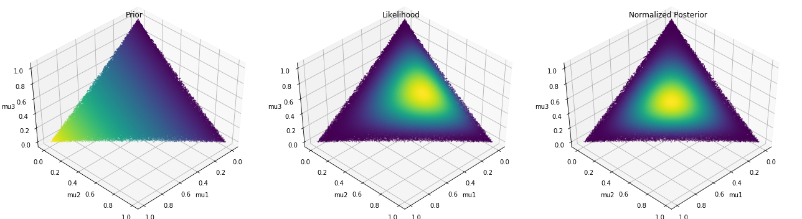
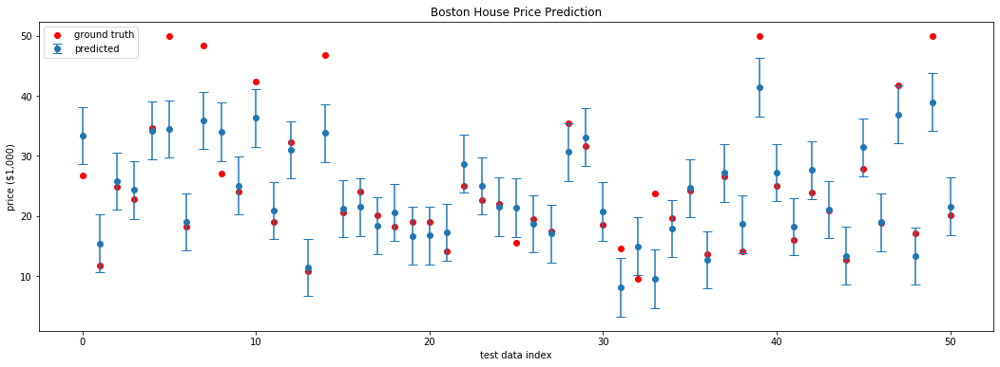
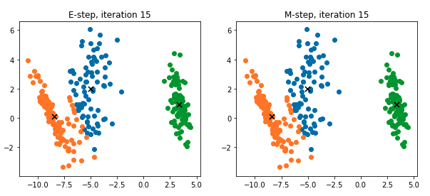
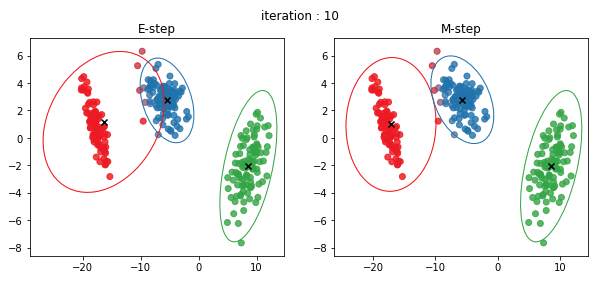
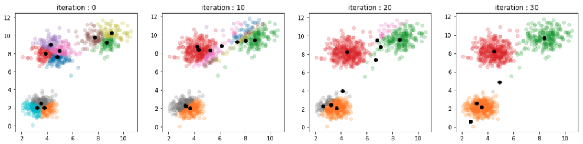
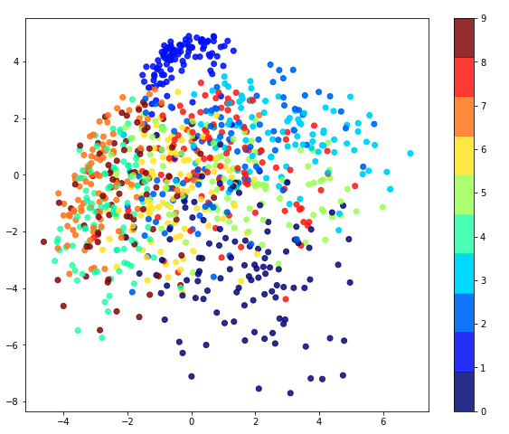
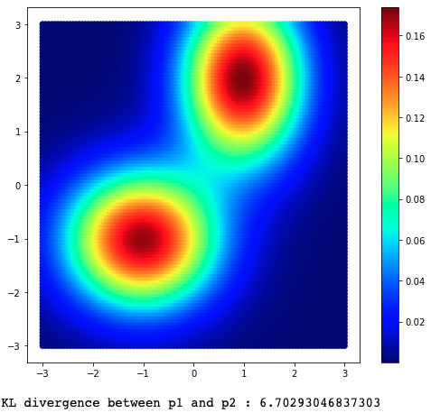
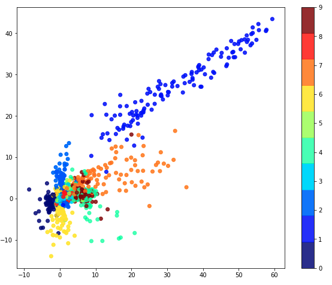

# deeplearning-espresso
deeplearning-espresso (Bayesian Statistics for Deep Learning)

## Day1

#### Beta Distribution

#### Dirichlet Distribution

#### Posterior Update

#### Linear Regression

#### Bayesian Linear Regression

#### Bayesian Linear Regression (Boston Housing)

## Day2

#### K-means

#### Gaussian Mixture Models

#### Variational Gaussian Mixture Models

#### Probabilistic PCA

#### KL-Divergence

#### Auto-Encoders

